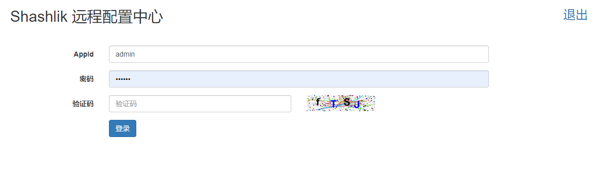
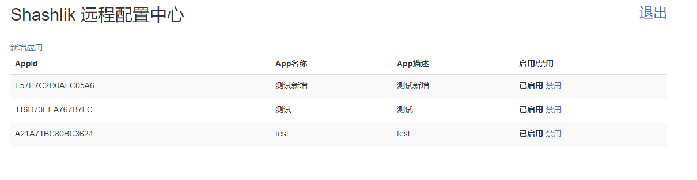
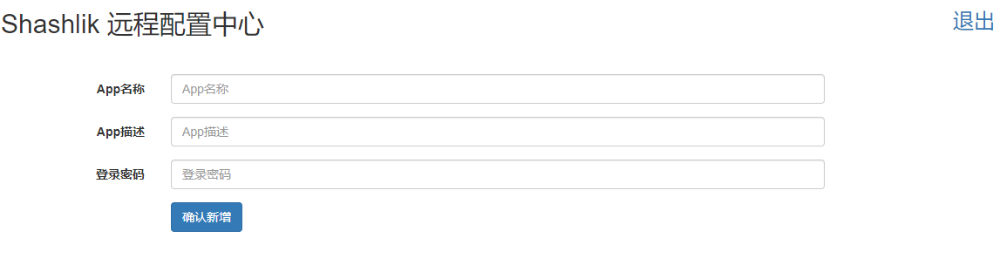
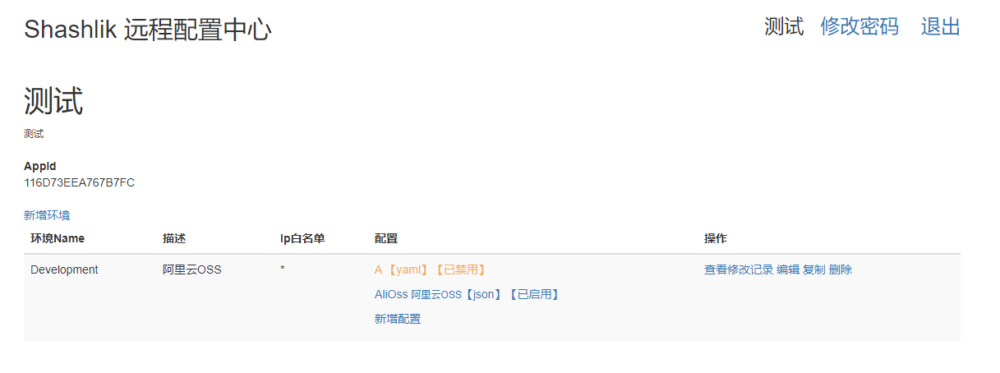
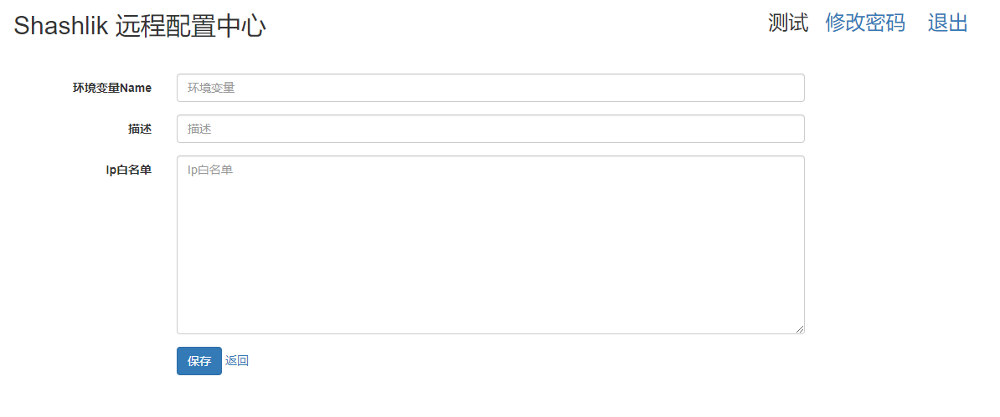
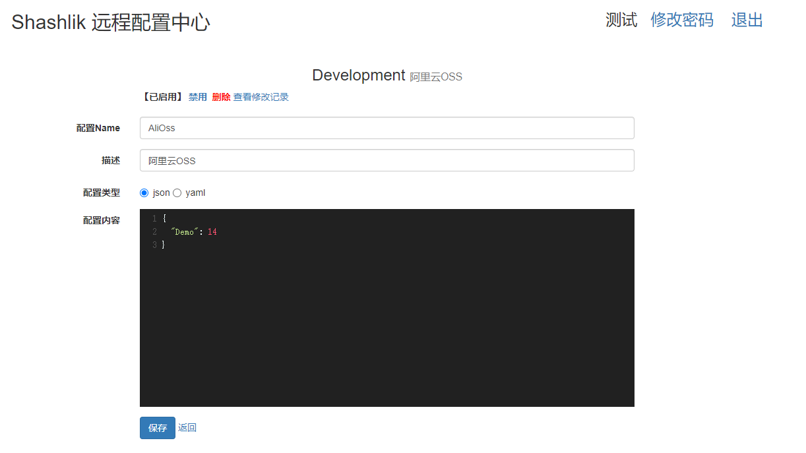

# Shashlik RC 远程配置中心

---

Shashlik RC 是一个使用.net core 开发的远程配置中心。功能非常简单实用，就是存储程序的配置文件，目前支持 json 和 yaml 格式，以解决本地文件式配置的繁琐和管理问题，比如集群、分布式、容器环境下文件式配置的管理、以及配置更新会让人崩溃。那么 Shashlik RC 就是为了解决这些问题而出现的。它没有那么多繁琐、庞大的功能，它仅仅只是将你的配置文件统一在配置中心管理，如果你需要服务注册？权限管理？流程治理？那么 Shashlik RC 显然不适合你，出门右转有`Apollo`、`Nacos`等等。Shashlik RC 目前只支持单机部署（如果你觉得你的应用数量有上万个以上，甚至配置数据更新、配置访问并发量非常高，那么你也可以出门右转），使用 websocket 实时推送配置更新，占用资源非常少。

Shashlik RC 分为应用管理端，即管理员登录，管理各个应用。应用配置端，登录具体的应用，管理该应用所有的配置数据（登录地址统一为：/Account/Login）。

## docker 快速启动 server

```
sudo git clone https://github.com/dotnet-shashlik/rcconfig.git

cd rcconfig

sudo docker-compose up -d
```
嗯，就这么简单，你就启动了一个 Shashlik RC 服务端。可以修改 docker-compose.yml 文件的环境变量以使用实际的配置。访问地址：http://{your host}/Account/Login。

## 服务端配置

- 服务端可配置项：
    - ADMIN_USER: 管理员账户，默认值：admin
    - ADMIN_PASS: 管理员密码，默认值:123123
    - DB_TYPE: 数据库类型，默认值：sqlite
    - DB_CONN: 数据库连接字符串，默认值：Data Source=./data/rc.db;
    - DB_VERSION: 数据库版本，mysql需要，默认值：5.7

- 环境变量配置(docker-compose.yaml)：

```yaml
# 绑定url、端口
ASPNETCORE_URLS: http://*:8989
# 管理员账户
ADMIN_USER: admin
# 管理密码
ADMIN_PASS: 123123
# 数据库类型: sqlite/mysql/npgsql/sqlserver
DB_TYPE: sqlite
# 数据库连接字符串
DB_CONN: Data Source=./data/rc.db;
# 数据库版本，mysql需要，默认值5.7，其他版本需要手动定义
#DB_VERSION: "8.0"
```

- 配置文件配置

配置文件目录：./data/appsettings.yaml。docker-compose已默认挂载./data目录，可以直接修改。**配置文件优先级高于环境变量**。例：

```yaml
Logging:
  LogLevel:
    Default: Information
AllowedHosts: "*"
# 管理员账户
ADMIN_USER: admin
# 管理密码
ADMIN_PASS: 123123
# 数据库类型: sqlite/mysql/npgsql/sqlserver
DB_TYPE: sqlite
# 数据库连接字符串
DB_CONN: Data Source=./data/rc.db;
# 数据库版本，mysql需要，默认值5.7，其他版本需要手动定义
#DB_VERSION: "8.0"
```

## 源码结构

 - Shashlik.RC: 服务端项目
 - Shashlik.RC.Config: .net 客户端，已发布到nuget。使用命令安装`Install-Package Shashlik.RC.Config`
 - Shashlik.RC.Config.Demo: .net 客户端demo，可以同时启动`Shashlik.RC`和`Shashlik.RC.Config.Demo`，服务端：http://localhost:5000，demo客户端：http://localhost:6001/demo/demo
 - Shashlik.RC.Data: 配置存储lib
 - Shashlik.RC.Data.MySql: MySql存储驱动
 - Shashlik.RC.Data.PostgreSql: PostgreSql存储驱动
 - Shashlik.RC.Data.Sqlite: Sqlite存储驱动
 - Shashlik.RC.Data.SqlServer: SqlServer存储驱动 

## 新增应用

使用管理账户、密码登录管理中心，新增应用。AppId 才是具体应用登录的账户。

## 登录应用

使用 AppId 和新增应用时设置的密码进行登录。

## 新增配置环境

例 Development/Test/Production，客户端将直接使用当前程序的环境名称。

## 新增配置文件

就像新增本地配置文件一样

## .net core 客户端连接

1. 安装 nuget 包

```
Install-Package Shashlik.RC.Config

```

2. 配置连接
   在 appsettings.json 中增加 server

```json
{
  "RCConfig": {
    "Server": "<your server host>",
    "AppId": "<app id>",
    "AppKey": "<app key>",
    // 轮询获取配置的间隔，单位秒，0：不配置
    "Polling": 300
  }
}
```

3. 启用远程配置

`.UseRCConfiguration()`即启用远程配置。

```c#
using Microsoft.AspNetCore.Hosting;
using Microsoft.Extensions.Configuration;
using Microsoft.Extensions.Hosting;

namespace Shashlik.RC.Config.Demo
{
    public class Program
    {
        public static void Main(string[] args)
        {
            CreateHostBuilder(args).Build().Run();
        }

        public static IHostBuilder CreateHostBuilder(string[] args) =>
            Host.CreateDefaultBuilder(args)
                // 启动远程配置
                .UseRCConfiguration()
                .ConfigureWebHostDefaults(webBuilder =>
                {
                    webBuilder.UseStartup<Startup>();
                });
    }
}
```

4. 配置 websocket 实时推送

```c#
    public void Configure(IApplicationBuilder app, IWebHostEnvironment env)
    {
        // ...
        app.UseRouting();
        app.ApplicationServices.UseRCRealTimeUpdate();
        // ...
    }
```

## pictures

- login


- admin


- add app


- configurations


- add environment


- config file
